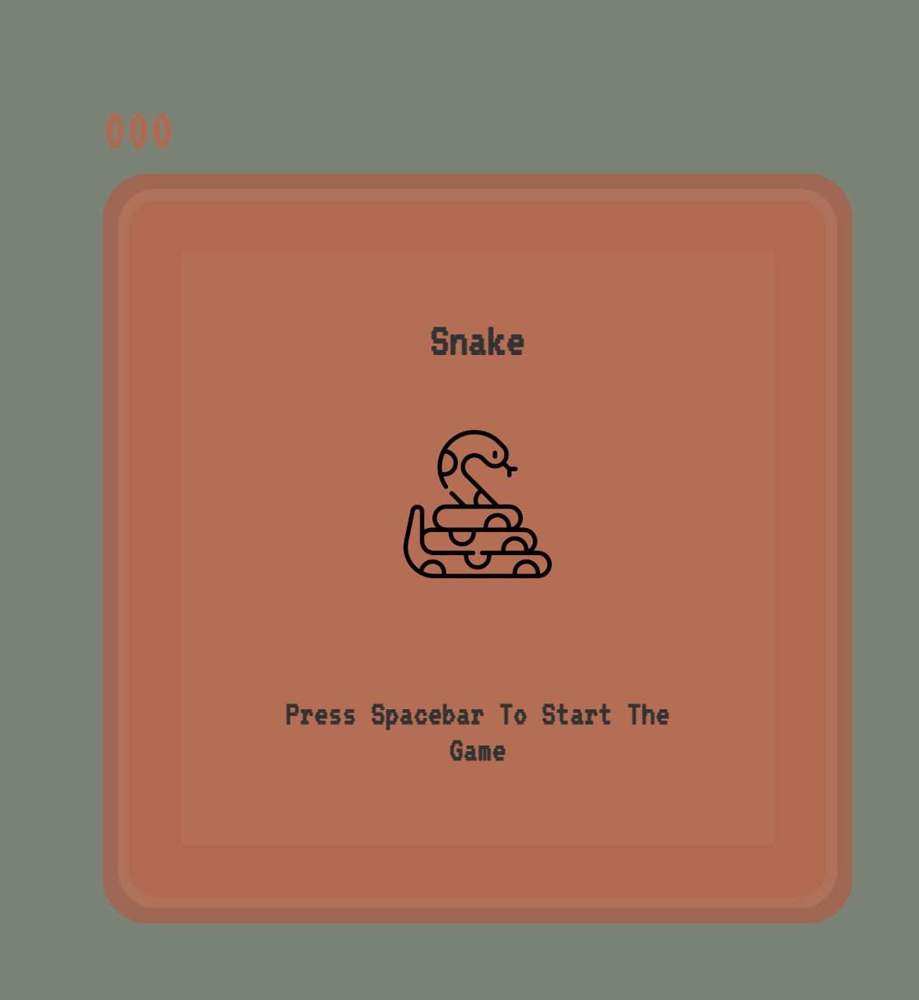

# Snake Game

  

## About the Project
***
A retro style snake game. The snake moves, grows and increases speed as it eats the food. The game ends when the snake collides with the wall or itself.

***
#### **Built With**
Simply built using HTML, CSS, and Javascript.

Built using this tutorial [Build a Snake Game in JavaScript](https://www.youtube.com/watch?v=QTcIXok9wNY)

Snake image made by [Freepik](www.flaticon.com)  

## **Contact**
***
[Deep Prajapati](mailto:dprajap2@gmail.com?subject=[GitHub])

[LinkedIn](https://www.linkedin.com/in/deepprajapati)

[Github](https://github.com/dprajapati4/)

